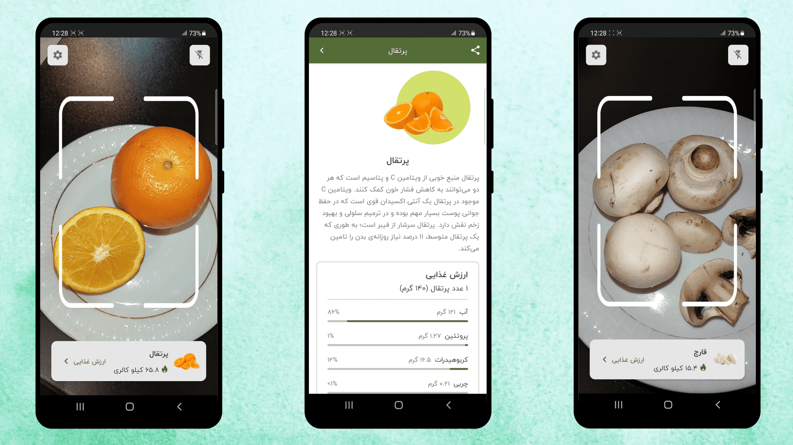

Find nutrition facts using your phone camera!

Mentha is an Android application that finds nutrition facts by scanning foods using a phone camera.
Under the hood, It performs Image Classification with a MobileNet CNN model over the TensorFlow
framework.

## Screenshots

## ⚙ Technologies

The project uses the [TensorFlow Lite](https://www.tensorflow.org/lite) framework to run the image
classification model on an android device. The model is
a [MobileNet V3](https://arxiv.org/abs/1704.04861) CNN architecture trained over
the [ILSVRC](https://www.kaggle.com/c/imagenet-object-localization-challenge/overview/description)
dataset, a subset of [ImageNet](https://www.image-net.org). It is available
on [TensorFlow Hub](https://tfhub.dev/google/lite-model/imagenet/mobilenet_v3_large_100_224/feature_vector/5/default/1)
.

> :warning: **The current model supports
a [limited number](/image-classifier/src/main/java/dev/alibagherifam/mentha/imageclassifier/AllowedLabels.kt)
of food classes**. As a future roadmap, I will use
> the [transfer learning](https://www.tensorflow.org/lite/models/modify/model_maker) technique to
> customize the model for a broader range of food classes.

Other Android technologies:

- Kotlin Coroutines
- AndroidX Camera
- AndroidX Lifecycle
- AndroidX Room
- KSP
- Jetpack Compose
- Material 3
- Coil
- Composite Builds
- Convention Plugins
- Version Catalog

## 📕 Terminology

According to [Wikipedia](https://en.wikipedia.org/wiki/Mentha):

> "Mentha (also known as mint) is a genus of plants in the family Lamiaceae (mint family)."

As a boy whose childhood was full of stomachaches, the word mentha means as a potion of healing to
me. So I named the project Mentha.

## 💡 Inspiration

This was the final project for the Artificial Intelligence course during my B.Sc. in Computer
Engineering.

## 🤝 Contribution

Feel free to create pull requests, especially ML model improvements ;)

## 🙏 Acknowledgment

Thanks to [Dr. Hamidreza Hamidi](http://ikiu.ac.ir/members/?id=46&lang=1) for his guidance toward
the project.

License
--------

    Copyright 2023 Ali Bagherifam

    Licensed under the Apache License, Version 2.0 (the "License");
    you may not use this file except in compliance with the License.
    You may obtain a copy of the License at

       http://www.apache.org/licenses/LICENSE-2.0

    Unless required by applicable law or agreed to in writing, software
    distributed under the License is distributed on an "AS IS" BASIS,
    WITHOUT WARRANTIES OR CONDITIONS OF ANY KIND, either express or implied.
    See the License for the specific language governing permissions and
    limitations under the License.

